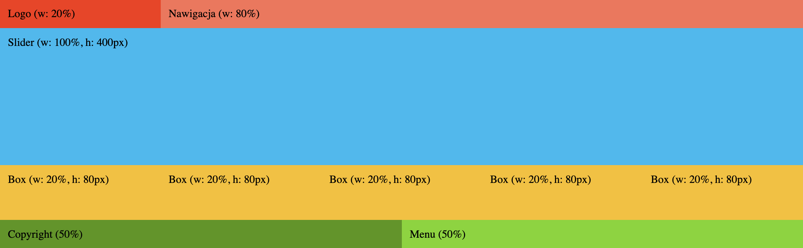

# Kilka ważnych informacji

Przed przystąpieniem do rozwiązywania zadań przeczytaj poniższe wskazówki

## Jak zacząć?

1. Stwórz [*fork*](https://guides.github.com/activities/forking/) repozytorium z zadaniami.
2. Sklonuj fork repozytorium (stworzony w punkcie 1) na swój komputer. Użyj do tego komendy `git clone adres_repozytorium`
Adres możesz znaleźć na stronie forka repozytorium po naciśnięciu w guzik "Clone or download".
3. Rozwiąż zadania i skomituj zmiany do swojego repozytorium. Użyj do tego komend `git add nazwa_pliku`.
Jeżeli chcesz dodać wszystkie zmienione pliki użyj `git add .` 
Pamiętaj że kropka na końcu jest ważna!
Następnie skommituj zmiany komendą `git commit -m "nazwa_commita"`
4. Wypchnij zmiany do swojego repozytorium na GitHubie.  Użyj do tego komendy `git push origin master`
5. Stwórz [*pull request*](https://help.github.com/articles/creating-a-pull-request) do oryginalnego repozytorium, gdy skończysz wszystkie zadania.

Poszczególne zadania rozwiązuj w odpowiednich plikach.

### Poszczególne zadania rozwiązuj w odpowiednich plikach.

**Repozytorium z ćwiczeniami zostanie usunięte 2 tygodnie po zakończeniu kursu. Spowoduje to też usunięcie wszystkich forków, które są zrobione z tego repozytorium.**


> ### Uwagi do egzaminu
> 1. Zadania rozwiązuj w odpowiednich plikach w katalogu `scss/partials` (np.: `scss/partials/_task01.scss`).
> 1. Masz już gotowy plik ```main.scss``` importujący wszystkie zadania.
> 1. Wynik kompilacji pliku `scss/main.scss` zapisz do pliku `css/main.css` - nie zmieniaj ułożenia folderów i plików!


## Zadanie 1

Stwórz podstawowy reset CSS w pliku `scss/partials/_task01.scss`.


## Zadanie 2

W pliku `scss/partials/_task02.scss` Stwórz **mapę** 5 kolorów:

* gold - `#f9c00c`
* blue - `#00b9f1`
* purple - `#7200da`
* red - `#f9320c`
* green - `#75D701`

Za pomocą interpolacji i pętli nadaj powyższe kolory jako tła dla elementów o klasach `el-1`, `el-2` itd. znajdujących się w sekcji o klasie `task-02`.

Za pomocą flex ułóżmy elementy o tych klasach obok siebie. Każdy element powinien mieć `200px` wysokości.

Pamiętaj o użyciu odpowiednich modułów Sass (`@use`)!

## Zadanie 3

Stwórz mixin o nazwie ```arrow```. Mixin powinien przyjmować __3__ parametry ```$color```, ```$direction```, ```$size```.
Celem mixina jest stworzenie strzałki o zadanym kolorze, kierunku i wielkości.


Wywołaj przygotowanego mixina dla **4 przygotowanych elementów** w sekcji o klasie `task-03` zgodnie z ich nazwami klas, np. `arrow-test-blue-top-20px`: to niebieska strzałka skierowana w górę o wymiarach `20px` na `20px`:

```scss
.arrow-test {
  &-blue-top-20px {
    @include arrow(blue, top, 20px);
  }
}
```


__Wskazówki:__ 
* nie używaj pseudoelementów 
* nazwa mixina to ```arrow```, nie zmieniaj jej!
* niech kolejność parametrów będzie taka jak w przykładzie wywołania ($color, $direction, $size)


## Zadanie 4

Przy użyciu zmiennych i pętli utwórz wszystkie klasy potrzebne aby zrobić swój własny grid. 

Zakładamy, że grid przyjmuje układ 10-kolumnowy oraz główny kontener posiada `1200px` szerokości.
 
Klasy związane z szerokością elementu nazwij `.col-X` - na przykład `.col-1`, `.col-2` ... `.col-10`. Nie zapominaj o klasach `container` oraz `row`.

Na podstawie stworzonego grida, odwzoruj w sekcji o klasie `task-04` następujący układ:



Należy użyć **kolorów z mapy** stworzonej w drugim zadaniu!

- Logo: kolor pod kluczem `red`
- Nawigacja: kolor pod kluczem `red` rozjaśniony o `30%` (należy użyć odpowiedniej funkcji)
- Slider: kolor pod kluczem `blue`
- Box: kolor pod kluczem `gold`
- Copyright: kolor pod kluczem `green` przyciemniony o `30%` (należy użyć odpowiedniej funkcji)
- Menu: kolor pod kluczem `green`


## Zadanie 5

 W sekcji o klasie `task-05` znajduje się obrazek. Ustaw tej sekcji `100vh` wysokości. 
 
 Następnie opisz odpowiednie warunki tak aby:
* Gdy ekran ma `1025px` szerokości lub więcej obraz miał `600px` szerokości i był **idealnie na środku sekcji** (w pionie i poziomie),
* Gdy ekran ma między `768px` a `1024px` szerokości (włączając w to wymienione wartości) to obrazek miał `200px` szerokości i był w **prawym górnym rogu sekcji**,
* Gdy ekran ma `767px` szerokości lub mniej to obrazek ma **całą dostępną szerokość** sekcji.

**Zachowaj konwencję Mobile First**!

Pamiętaj, aby obrazek zawsze miał **zachowane proporcje** (nie może być rozciągnięty w pionie lub w poziomie)!

Korzystaj tylko z **flexboxa**.
